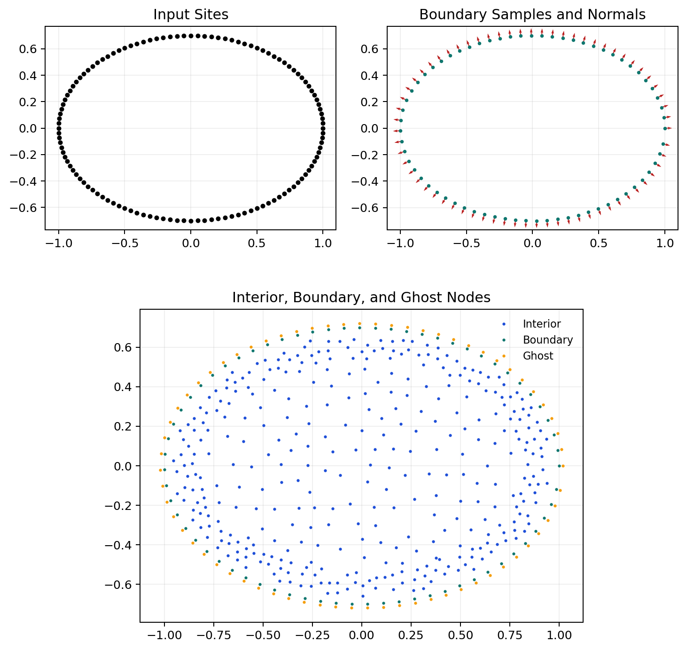
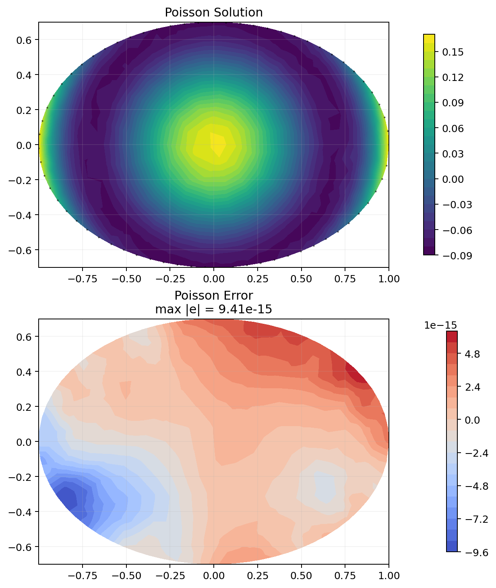
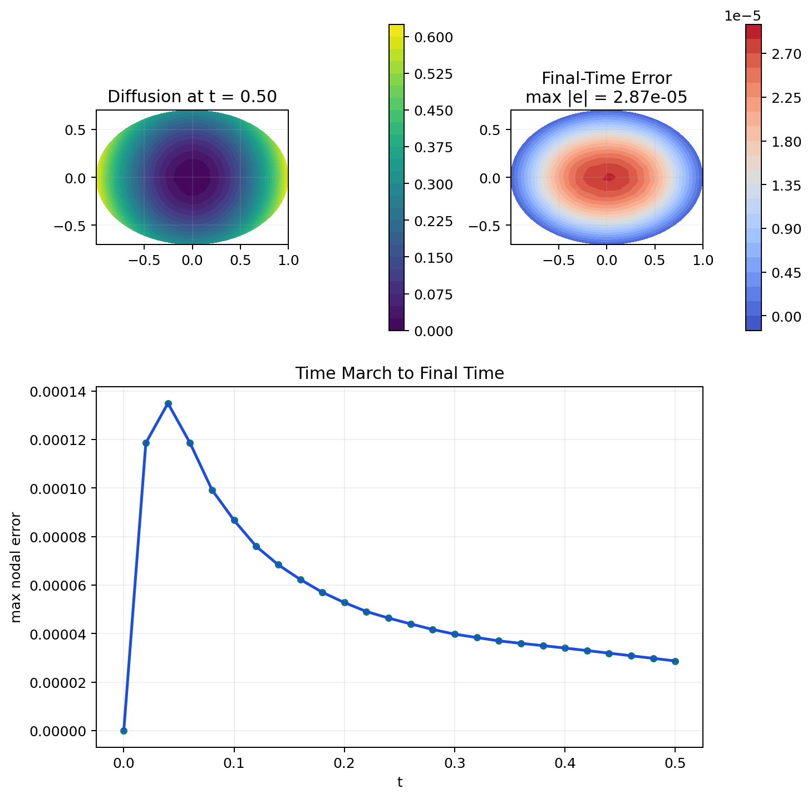

# kernelpack-python

`kernelpack-python` is a Python-first port of
[`kernelpack-matlab`](https://github.com/ShankarLab/kernelpack-matlab).

It brings the main geometry, node-generation, polynomial, RBF-FD, and solver
ingredients of KernelPack into a Python codebase that is efficient,
inspectable, and ready for scripting, experimentation, and extension.

This is a real port, not a placeholder wrapper around the Matlab project. The
goal is to keep the same overall KernelPack-style workflow while leaning into
Python strengths such as NumPy/SciPy vectorization, sparse linear algebra, and
testable modular code.

## What it includes

- Geometry objects for smooth and piecewise-smooth boundaries and surfaces:
  `EmbeddedSurface`, `PiecewiseSmoothEmbeddedSurface`, and `RBFLevelSet`
- Seeded fixed-radius Poisson node generation in axis-aligned boxes, with
  geometry-aware clipping and boundary refinement through
  `DomainNodeGenerator`
- A compact `DomainDescriptor` for interior, boundary, ghost nodes, normals,
  and nearest-neighbor search structures
- Shared polynomial utilities in `kernelpack.poly`, including Legendre-based
  `PolynomialBasis`
- RBF-FD and weighted least-squares stencil and assembly classes in
  `kernelpack.rbffd`
- Fixed-domain `PoissonSolver` and `DiffusionSolver`

The main packages live in:

- [`src/kernelpack/geometry`](/E:/kernelpack-python/src/kernelpack/geometry)
- [`src/kernelpack/nodes`](/E:/kernelpack-python/src/kernelpack/nodes)
- [`src/kernelpack/domain`](/E:/kernelpack-python/src/kernelpack/domain)
- [`src/kernelpack/poly`](/E:/kernelpack-python/src/kernelpack/poly)
- [`src/kernelpack/rbffd`](/E:/kernelpack-python/src/kernelpack/rbffd)
- [`src/kernelpack/solvers`](/E:/kernelpack-python/src/kernelpack/solvers)

## Supported workflows

- Smooth closed curves and smooth closed 3D surfaces
- Open curve segments and open 3D surface patches
- Piecewise-smooth planar boundaries and piecewise 3D surfaces
- Fixed-radius Poisson disk sampling in any dimension
- Level-set clipping of box clouds to geometry-defined domains
- Standard and overlapped RBF-FD assembly
- Fixed-domain Poisson solves
- Fixed-domain diffusion stepping with BDF1, BDF2, and BDF3

## Status

The current Python port includes the main numerical layers that sit underneath
typical KernelPack-style workflows:

- geometry fitting and level-set construction
- domain node generation
- polynomial bases and multi-index utilities
- local RBF-FD and weighted least-squares stencils
- sparse operator assembly
- fixed-domain Poisson and diffusion solvers

The public API follows Python naming conventions, so Matlab-style methods such
as `buildClosedGeometricModelPS` appear here as snake_case methods like
`build_closed_geometric_model_ps`.

## Installation

From the repository root:

```bash
python -m venv .venv
.venv\Scripts\activate
python -m pip install -e .[dev]
```

Run the test suite with:

```bash
python -m pytest -q
```

## Examples and checks

Current Python checks live in:

- [`tests/test_poly.py`](/E:/kernelpack-python/tests/test_poly.py:1)
- [`tests/test_nodes_rbffd.py`](/E:/kernelpack-python/tests/test_nodes_rbffd.py:1)
- [`tests/test_solvers.py`](/E:/kernelpack-python/tests/test_solvers.py:1)

The examples below are written as direct Python snippets so you can paste them
into a script, notebook, or REPL.

## Quick examples

### Smooth 2D geometry

```python
import matplotlib.pyplot as plt
import numpy as np

from kernelpack.geometry import EmbeddedSurface

# Define a smooth closed planar boundary.
t = np.linspace(0.0, 2.0 * np.pi, 50, endpoint=False)
curve = np.column_stack([np.cos(t), 0.7 * np.sin(t)])

# Build the geometric model and level set.
surface = EmbeddedSurface()
surface.set_data_sites(curve)
surface.build_closed_geometric_model_ps(2, 0.05, curve.shape[0])
surface.build_level_set_from_geometric_model()

# Extract boundary samples and normals from the fitted representation.
xb = surface.get_sample_sites()
nrmls = surface.get_nrmls()

# Plot the fitted boundary samples and normals.
fig, ax = plt.subplots(figsize=(6, 6))
ax.plot(curve[:, 0], curve[:, 1], "ko", ms=3, label="input sites")
ax.plot(xb[:, 0], xb[:, 1], ".", color="tab:teal", ms=4, label="boundary samples")
step = max(1, xb.shape[0] // 40)
ax.quiver(
    xb[::step, 0],
    xb[::step, 1],
    nrmls[::step, 0],
    nrmls[::step, 1],
    angles="xy",
    scale_units="xy",
    scale=18,
    color="tab:red",
    width=0.003,
)
ax.set_aspect("equal", adjustable="box")
ax.grid(alpha=0.2)
ax.legend(frameon=False)
plt.show()
```



### Geometry-clipped interior nodes

```python
import matplotlib.pyplot as plt

from kernelpack.nodes import DomainNodeGenerator

# Generate an interior-plus-boundary domain from a geometry and target spacing.
generator = DomainNodeGenerator()
domain = generator.build_domain_descriptor_from_geometry(
    surface,
    0.08,
    seed=17,
    strip_count=5,
    do_outer_refinement=True,
    outer_fraction_of_h=0.5,
    outer_refinement_zone_size_as_multiple_of_h=2.0,
)

# Pull out the packed node sets.
xi = domain.get_interior_nodes()
xb = domain.get_bdry_nodes()
xg = domain.get_ghost_nodes()

# Visualize the packed node sets.
fig, ax = plt.subplots(figsize=(6, 6))
ax.plot(xi[:, 0], xi[:, 1], ".", ms=3, color="tab:blue", label="interior")
ax.plot(xb[:, 0], xb[:, 1], ".", ms=3, color="tab:teal", label="boundary")
ax.plot(xg[:, 0], xg[:, 1], ".", ms=3, color="goldenrod", label="ghost")
ax.set_aspect("equal", adjustable="box")
ax.grid(alpha=0.2)
ax.legend(frameon=False)
plt.show()
```

### RBF-FD operator assembly

```python
from kernelpack.rbffd import FDDiffOp, OpProperties, RBFStencil, StencilProperties

# Ask the code to choose stencil parameters from a target accuracy.
sp = StencilProperties.from_accuracy(
    operator="lap",
    convergence_order=4,
    dimension=2,
    approximation="rbf",
    tree_mode="all",
    point_set="interior_boundary",
)

# Record stencil metadata during assembly.
op = OpProperties(record_stencils=True)

# Assemble a Laplacian on the domain descriptor.
assembler = FDDiffOp(lambda: RBFStencil())
assembler.assemble_op(domain, "lap", sp, op)
L = assembler.get_op()
```

### End-to-end Poisson solve with pure Neumann data

```python
import matplotlib.pyplot as plt
import matplotlib.tri as mtri
import numpy as np

from kernelpack.geometry import EmbeddedSurface
from kernelpack.nodes import DomainNodeGenerator
from kernelpack.solvers import PoissonSolver

# Build a smooth closed domain.
t = np.linspace(0.0, 2.0 * np.pi, 120, endpoint=False)
curve = np.column_stack([np.cos(t), np.sin(t)])

surface = EmbeddedSurface()
surface.set_data_sites(curve)
surface.build_closed_geometric_model_ps(2, 0.06, curve.shape[0])
surface.build_level_set_from_geometric_model()

# Generate interior, boundary, and ghost nodes.
generator = DomainNodeGenerator()
domain = generator.build_domain_descriptor_from_geometry(
    surface,
    0.08,
    seed=17,
    strip_count=5,
)

# Set up an RBF-FD Poisson solve on that domain.
solver = PoissonSolver(
    lap_assembler="fd",
    bc_assembler="fd",
    lap_stencil="rbf",
    bc_stencil="rbf",
)

# Use a named target order instead of a magic number.
target_order = 4
solver.init(domain, target_order)

# Manufactured pure-Neumann problem on the unit disk.
u_exact = lambda X: (X[:, 0] ** 2 + X[:, 1] ** 2) ** 2 - (X[:, 0] ** 2 + X[:, 1] ** 2) + 1.0 / 6.0
forcing = lambda X: 4.0 - 16.0 * (X[:, 0] ** 2 + X[:, 1] ** 2)
neu_coeff = lambda Xb: np.ones(Xb.shape[0])
dir_coeff = lambda Xb: np.zeros(Xb.shape[0])
bc = lambda neu_coeffs, dir_coeffs, nr, Xb: np.sum(
    np.column_stack(
        [
            4.0 * Xb[:, 0] * (Xb[:, 0] ** 2 + Xb[:, 1] ** 2) - 2.0 * Xb[:, 0],
            4.0 * Xb[:, 1] * (Xb[:, 0] ** 2 + Xb[:, 1] ** 2) - 2.0 * Xb[:, 1],
        ]
    )
    * nr,
    axis=1,
)

# Solve and align the mean for comparison.
result = solver.solve(forcing, neu_coeff, dir_coeff, bc)
x_phys = domain.get_int_bdry_nodes()
u = result["u"]
u_true = u_exact(x_phys)
u = u - np.mean(u - u_true)
err = u - u_true

# Plot the solution and its nodal error.
tri = mtri.Triangulation(x_phys[:, 0], x_phys[:, 1])
fig, axes = plt.subplots(2, 1, figsize=(6.5, 8), constrained_layout=True)
cf0 = axes[0].tricontourf(tri, u, levels=24, cmap="viridis")
axes[0].plot(domain.get_bdry_nodes()[:, 0], domain.get_bdry_nodes()[:, 1], "k.", ms=1.5, alpha=0.5)
axes[0].set_title("Poisson solution")
fig.colorbar(cf0, ax=axes[0], shrink=0.9)

cf1 = axes[1].tricontourf(tri, err, levels=24, cmap="coolwarm")
axes[1].set_title(f"Poisson error, max |e| = {np.max(np.abs(err)):.2e}")
fig.colorbar(cf1, ax=axes[1], shrink=0.9)

for ax in axes:
    ax.set_aspect("equal", adjustable="box")
    ax.grid(alpha=0.15)

plt.show()
```



### Diffusion stepping

```python
import matplotlib.pyplot as plt
import matplotlib.tri as mtri
import numpy as np

from kernelpack.solvers import DiffusionSolver

# Set up a fixed-domain diffusion stepper on the same domain.
solver = DiffusionSolver(
    lap_assembler="fd",
    bc_assembler="fd",
    lap_stencil="rbf",
    bc_stencil="rbf",
)

# Choose the diffusivity and time step.
nu = 0.25
dt = 0.02

# Use a named target order instead of a magic number.
target_order = 4
solver.init(domain, target_order, dt, nu)

# Define a manufactured transient problem with Dirichlet data.
u_exact = lambda time, X: np.exp(-time) * (X[:, 0] ** 2 + X[:, 1] ** 2)
forcing = lambda nu_value, time, X: (
    -np.exp(-time) * (X[:, 0] ** 2 + X[:, 1] ** 2)
    - 4.0 * nu_value * np.exp(-time)
)
neu_coeff = lambda Xb: np.zeros(Xb.shape[0])
dir_coeff = lambda Xb: np.ones(Xb.shape[0])
bc = lambda neu_coeffs, dir_coeffs, nr, time, Xb: u_exact(time, Xb)

# March the solution to a final time.
t_final = 0.50
nsteps = int(round(t_final / dt))
x_phys = domain.get_int_bdry_nodes()

solver.set_initial_state(u_exact(0.0, x_phys))
times = [0.0]
states = [solver.current_physical_state().copy()]

for step in range(1, nsteps + 1):
    time = step * dt
    if step == 1:
        u_next = solver.bdf1_step(time, forcing, neu_coeff, dir_coeff, bc)
    elif step == 2:
        u_next = solver.bdf2_step(time, forcing, neu_coeff, dir_coeff, bc)
    else:
        u_next = solver.bdf3_step(time, forcing, neu_coeff, dir_coeff, bc)
    times.append(time)
    states.append(u_next.copy())

# Compare against the manufactured solution at the final time.
u_final = states[-1]
u_true_final = u_exact(t_final, x_phys)
max_error = np.max(np.abs(u_final - u_true_final))
err = u_final - u_true_final

# Plot the final state, final-time error, and time history of the max nodal error.
tri = mtri.Triangulation(x_phys[:, 0], x_phys[:, 1])
fig = plt.figure(figsize=(8, 8), constrained_layout=True)
axes = fig.subplot_mosaic([["solution", "error"], ["history", "history"]])

cf0 = axes["solution"].tricontourf(tri, u_final, levels=24, cmap="viridis")
axes["solution"].set_title(f"Diffusion at t = {t_final:.2f}")
fig.colorbar(cf0, ax=axes["solution"], shrink=0.85)

cf1 = axes["error"].tricontourf(tri, err, levels=24, cmap="coolwarm")
axes["error"].set_title(f"Final-time error, max |e| = {max_error:.2e}")
fig.colorbar(cf1, ax=axes["error"], shrink=0.85)

error_history = [np.max(np.abs(state - u_exact(time, x_phys))) for time, state in zip(times, states)]
axes["history"].plot(times, error_history, color="tab:blue", lw=2)
axes["history"].scatter(times, error_history, color="tab:teal", s=18)
axes["history"].set_xlabel("t")
axes["history"].set_ylabel("max nodal error")
axes["history"].set_title("Time march to final time")
axes["history"].grid(alpha=0.2)

for key in ("solution", "error"):
    axes[key].set_aspect("equal", adjustable="box")
    axes[key].grid(alpha=0.15)

plt.show()
```



## Package tour

### `kernelpack.geometry`

This package contains the geometry-facing pieces of the port:

- `EmbeddedSurface` for smooth closed and open fitted boundaries/surfaces
- `PiecewiseSmoothEmbeddedSurface` for segmented piecewise boundaries
- `RBFLevelSet` for implicit geometry representation and Newton projection
- shared helpers such as `distance_matrix`, `fibonacci_sphere`,
  `project_to_best_fit_plane`, and `phs_kernel`

These classes are intended to support the same overall workflow as the Matlab
version:

1. fit a geometric model to input sites
2. sample boundary points and normals
3. build an implicit level set
4. use that level set for node clipping and solver workflows

### `kernelpack.nodes`

This package handles point generation and geometry clipping:

- `generate_poisson_nodes_in_box`
- `clip_points_by_geometry`
- `bounding_box_extents`
- `DomainNodeGenerator`

The node-generation path supports:

- deterministic seeded box sampling
- geometry-aware clipping
- outer refinement bands near boundaries
- assembly of interior, boundary, and ghost nodes into a `DomainDescriptor`

### `kernelpack.domain`

`DomainDescriptor` is the compact container that links node generation and
operator assembly. It stores:

- interior nodes
- boundary nodes
- ghost nodes
- boundary normals
- all-node and subset node clouds
- KD-tree-backed nearest-neighbor structures
- domain metadata such as separation radius and level sets

### `kernelpack.poly`

This package provides shared polynomial support:

- Jacobi/Legendre/Chebyshev recurrence helpers
- tensor-product polynomial evaluation
- total-degree and hyperbolic-cross multi-index builders
- `PolynomialBasis`, including normalization around a local center and scale

This is the polynomial backbone used by both the RBF-FD and weighted
least-squares stencil paths.

### `kernelpack.rbffd`

This package contains the local discretization and assembly layer:

- `RBFStencil`
- `WeightedLeastSquaresStencil`
- `StencilProperties`
- `OpProperties`
- `FDDiffOp`
- `FDODiffOp`

Current operator support includes:

- interpolation
- directional gradients
- Laplacians
- mixed Neumann/Dirichlet boundary-condition rows

### `kernelpack.solvers`

This package contains the current fixed-domain solver layer:

- `PoissonSolver`
- `DiffusionSolver`

The solver layer is intentionally small and direct. It is built on top of the
same `DomainDescriptor` and `rbffd` operator assembly path rather than
introducing a separate abstraction stack.

## Design notes

The port aims to preserve the Matlab project's logic while still feeling
native in Python:

- snake_case API names instead of Matlab camel case
- dense local algebra through NumPy
- sparse global solves through SciPy
- nearest-neighbor structures through `scipy.spatial.cKDTree`
- focused tests that mirror the Matlab checks

The project direction is still to keep building outward from KernelPack-style
contracts rather than inventing a separate abstraction hierarchy.

## Notes

- This is a Python implementation of the main KernelPack ingredients, not yet
  a full one-to-one port of every C++ or Matlab path.
- Pure Neumann Poisson problems are solved with the usual nullspace
  augmentation, so comparisons should be made after aligning the constant.
- The repo includes both `RBFStencil` and `WeightedLeastSquaresStencil`; the
  weighted least-squares path reproduces low-order polynomial targets very
  cleanly, while the RBF-FD path tracks the KernelPack-style stencil
  formulation more directly.
- The Python port is under active development, and the README will continue to
  grow alongside new examples, solver workflows, and higher-level utilities.
